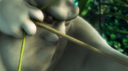
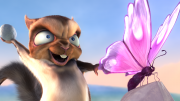
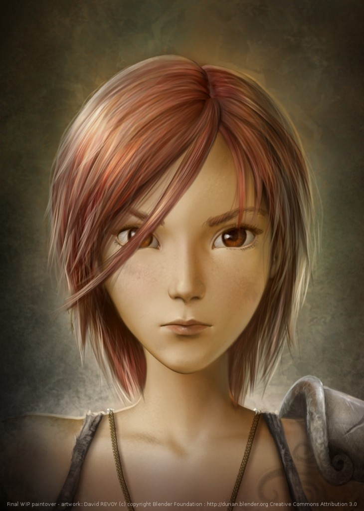

.. _label-lesson6:

====================================
Lesson6: 画像
====================================

   :保存ファイル名: lesson6.rst
   :必要な操作: ファイルの作成、編集

Webブラウザで表示させた状態で以降の行をテキストエディタにコピーの上、
レイアウト等を再現するよう編集してください。
(必要な画像はブラウザ上で右クリックの上保存して適宜配置してください)

   .. tip::
      
      ``make html`` 等で画像が表示されない場合には、 ``make clean`` 
      してから、 ``make html`` してみてください。

Blenderのロゴについて
===========================

Blenderのロゴ使用については"Blender logo usage guidelines"を参照ください。

   http://www.blender.org/blenderorg/blender-foundation/logo/

Blenderの起動
-------------

Blenderのアイコン( |logo| )をダブルクリックしてください。

Big Buck Bunny
------------------

`Big Buck Bunny <http://www.bigbuckbunny.org/>`_ は Blender Institute 
による **オープンムービー第2弾** です。

   まれに見るかっこいいでぶうさぎ。

   悪いフランキーめっ。

Sintel
------

`Sintel <http://www.sintel.org/>`_ は Blender Institute 
による **オープンムービー第3弾** です。

   やさぐれてる…

Project Mango
--------------

さて、オープンムービー第4弾 `Project Mango <http://mango.blender.org/>`_
は既に始まってますよー。
