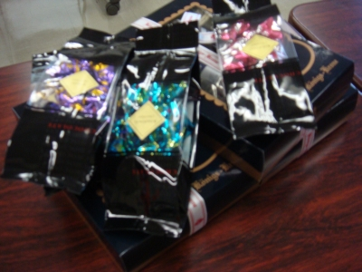
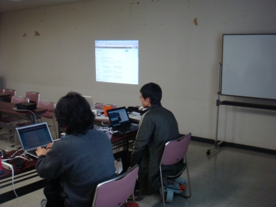
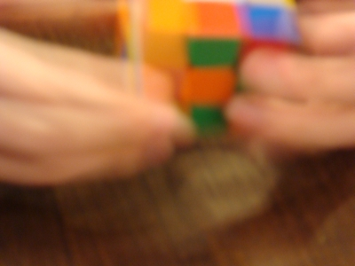
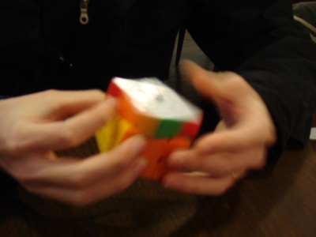
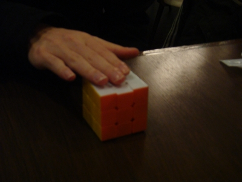

.. _label-report:

開催後レポートです。参加された皆さんありがとうございました!!

本編レポート
========================

開催時間前～オリエンテーション
------------------------------

なんと、高速神戸着の列車がが9:22分ということで、えーと、最初に開催する人がほぼ9:30入り、ってどういうこと?
なので相当テンパってました＾＾；

そしてっ、呼吸チョコ( http://www.marushige-brand.com/ ) と パイ ( http://konigs-krone.co.jp/goods/stick/pie.html ) がお茶うけでした。

参加者は講師である `@lab1092 <http://twitter.com/#!/lab1092>`_ を含め6人。まあその分お茶うけの各自の取り分が増えたわけですが。

最初の自己紹介で衝撃の事実が発覚。

   **みんな大阪から来てた**

まじですか。ありがとうございます。

内訳としては、学生さん2名、社会人4名という感じで、そしてその中には翻訳カフェ( http://translatecafe.org/wiki/ )の方とか、kyoto.py( https://groups.google.com/forum/#!forum/kyotopy )の方が紛れ込んでたり。

   「あらー、OSC名古屋のときはどうもー」

とかいう感じだったり。

ハンズオン
----------

もっとも、今回こられた方はほぼPython使っているorインストール済み、という **勉強熱心な方ばかり** でしたのでまあ、なんとかなるかなという感じでしたので、最初の導入と演習の仕方については本当に簡単に説明をして、早速 lesson1 https://github.com/lab1092/sphasa001/blob/master/part1/lesson1.rst から実際に行ってもらいました。

そして、今回演習をやってもらうに当たって、以下のようなことを言っていたような。

   * 時間中に、ここで用意したLesson1-6全部出来なくてもというか、出来るわけはないので気楽にいきましょう。
   * "make html" を実行できるようになるというのが今回の目的なので
   
そう言えばgithub のページは.rstファイルがレンダリングされるのでいいんですが、"ソースを表示"という手段を伝えてなかったのでした。ほとんどの方はプロジェクトをダウンロードして "make html" 出来るくらいの方でしたのでよかったよかった、ということで(ここは課題かな)。　

さらに、朝会のソースファイルをダウンロードして "make-html" を実行されている方は、 "Show Source" をクリックすると答えが分かる仕組みになっていること、その際にブラウザによっては文字コードの指定を明示的 *UTF-8* に指定してあげること、などを紹介しておきました。

その関連で、同様に "Show source" や "ソースコードを表示"というリンクがある場合には、元となる

と、まあ黙ってマークアップしてもらうのも何なので、最近自分がやっていることとか(みなさんの演習の邪魔をするように)話してみたりとかしてました。

開催後レポート(終了後)
========================
開催後はJR神戸駅構内のお店でご飯食べて喋ってました。そこで参加された一人の方から、「ルービックキューブ揃えていいですか？」と。というのが以下3枚。みるみる間にそろっていくのは圧巻です。

もうSphinxなんてどうでもよくなっちゃうレベルｗ
